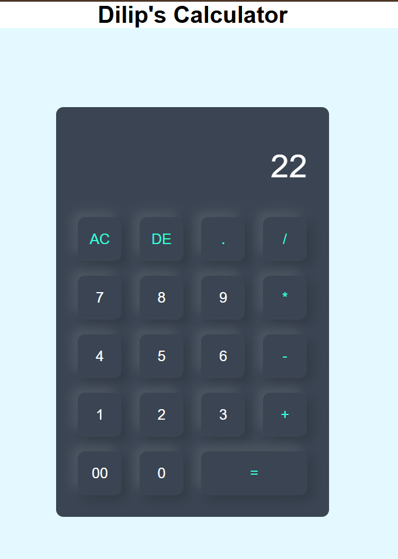

# 🧮 Simple Calculator

A clean and responsive calculator built using **HTML, CSS, and JavaScript** — no frameworks, just core web fundamentals.

This project was created to practice front-end basics and UI styling, with a focus on simplicity and user experience.

---

## 📸 Preview



---

## ✨ Features

* ➕ Addition, ➖ Subtraction, ✖️ Multiplication, ➗ Division
* 🔢 Decimal number support
* ⌫ Delete last digit (**DE**)
* 🧹 Clear all input (**AC**)
* ⚡ Instant evaluation using `=`
* 🎨 Modern UI with neumorphic-style design

---

## 🛠️ Tech Stack

* HTML5
* CSS3 (Flexbox, shadows, styling)
* JavaScript (Vanilla JS)

---

## 📂 Project Structure

```
calculator/
│── calculator.html
│── style.css
│── screenshot.png
```

---

## ▶️ How to Run

```bash
git clone https://github.com/DilipHS/Calculator.git
cd Calculator
```

Open `calculator.html` in your browser — no setup required.

---

## 💡 How It Works

* Button clicks update the display using JavaScript
* Expressions are evaluated dynamically
* Result is displayed instantly

---

## ⚠️ Note on `eval()`

This project uses JavaScript’s `eval()` function to evaluate expressions.

While it's perfectly fine for learning and small projects, it is **not recommended for production applications** due to security concerns.

---

## 🚀 Future Improvements

* Keyboard input support
* Error handling for invalid expressions
* Dark/Light theme toggle
* Replace `eval()` with custom parser

---

## 🙌 Author

**Dilip H S**
B.Tech CSE | Aspiring Software & AI Engineer

---

⭐ If you like this project, feel free to fork it and give it a star!
